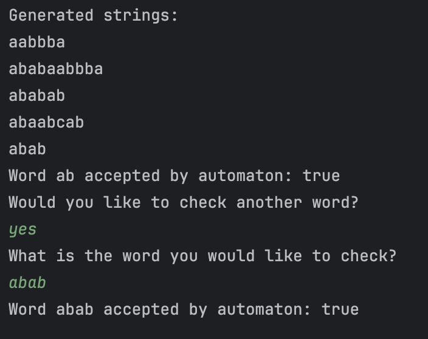

# LAB 1 : Regular Grammars

### Course: Formal Languages & Finite Automata
### Author: Victoria Mutruc

----

## Theory

A formal language consists of several essential components: an alphabet, a vocabulary, and a grammar. The alphabet is a 
set of valid characters, the vocabulary includes the valid words or strings formed from these characters, and the 
grammar defines the rules for how words can be structured within the language.
Formal languages are crucial in fields such as computer science, linguistics, and mathematics, as they provide a 
precise, unambiguous means of communication.

A grammar dictates how strings within the language are constructed. It includes non-terminal symbols, which can be 
replaced by other symbols or strings, and terminal symbols, which form the final structure of the string. 
Production rules define how strings can be derived by transforming one symbol into another. This structure is 
fundamental for determining the validity of strings within the language.

Finite Automata (FA) are mathematical models used to represent formal languages. A Finite Automaton is composed of a set
of states, input symbols, a transition function that describes the state changes based on input, a start state, and a 
set of final states. The FA operates by processing input strings and determining whether they belong to the language by 
checking if the final state is reached.

## Objectives:

1. Discover what a language is and what it needs to have in order to be considered a formal one;
2. Provide the initial setup for the evolving project that you will work on during this semester. You can deal with each laboratory work as a separate task or project to demonstrate your understanding of the given themes, but you also can deal with labs as stages of making your own big solution, your own project. Do the following:

    a. Create GitHub repository to deal with storing and updating your project;
    
    b. Choose a programming language. Pick one that will be easiest for dealing with your tasks, you need to learn how to solve the problem itself, not everything around the problem (like setting up the project, launching it correctly and etc.);
    
    c. Store reports separately in a way to make verification of your work simpler 

3. According to your variant number, get the grammar definition and do the following:

    a. Implement a type/class for your grammar;

    b. Add one function that would generate 5 valid strings from the language expressed by your given grammar;
    
    c. Implement some functionality that would convert and object of type Grammar to one of type Finite Automaton;
    
    d. For the Finite Automaton, please add a method that checks if an input string can be obtained via the state transition from it;
4. Implement the laboratory work for the following variant:
   ```
   Variant 21:
   VN={S, B, C, D},
   VT={a, b, c},
   P={
   S → aB     
   B → bS    
   B → aC   
   B → b    
   C → bD   
   D → a    
   D → bC
   D → cS
   }


## Implementation description

* The following method checks whether a given input string belongs to the language. It starts from the initial state and 
processes the input string symbol by symbol, transitioning between states based on the automaton's transition function. 
For each symbol, it checks if the symbol belongs to the alphabet and if a valid transition exists, and if not, it 
rejects the string immediately. If the string is processed successfully and ends in a final state, the string is 
accepted, otherwise, it is rejected.

```
public boolean stringBelongToLanguage(String inputString) {
        Set<String> currentStates = new HashSet<>();
        currentStates.add(startState);

        for (char symbol : inputString.toCharArray()) {
            String symbolString = String.valueOf(symbol);

            if (!alphabet.contains(symbolString)) {
                System.out.println("ERROR: Symbol '" + symbolString + "' not in alphabet!");
                return false;
            }

            Set<String> nextStates = new HashSet<>();
            for (String state : currentStates) {
                Map<String, Set<String>> stateTransitions = transitions.get(state);
                if (stateTransitions != null && stateTransitions.containsKey(symbolString)) {
                    nextStates.addAll(stateTransitions.get(symbolString));
                }
            }

            if (nextStates.isEmpty()) {
                System.out.println("No transition found for any state with symbol '" + symbolString + "'.");
                return false;
            }

            currentStates = nextStates;
        }

        for (String state : currentStates) {
            if (finalStates.contains(state)) {
                return true;
            }
        }

        return false;
    }
```

* The generateStrings method generates a specified number of valid strings that conform to the grammar. It starts with 
the start symbol and recursively applies production rules for non-terminal symbols until terminal symbols are reached. 
These terminal symbols are then combined together to form a complete string.

```
ublic List<String> generateStrings(String startSymbol, int numStrings){
        Set<String> generatedStrings = new HashSet<>();
        while(generatedStrings.size() < numStrings){
            StringBuilder sb = new StringBuilder();
            generateString(startSymbol, sb);
            generatedStrings.add(sb.toString());
        }
        return new ArrayList<>(generatedStrings);
    }

```

* The generateString method recursively processes a symbol, and if it's a terminal, it appends it directly to the output
string. If the symbol is non-terminal, it looks up the corresponding production rules and randomly selects one to 
further expand the string. This process continues until the entire string is formed by terminal symbols, representing a 
valid word in the language defined by the grammar.
```
private void generateString(String symbol, StringBuilder sb) {
        if (!this.P.containsKey(symbol)) {
            sb.append(symbol);
            return;
        }
        List<String> choices = this.P.get(symbol);
        String choice = choices.get(new Random().nextInt(choices.size()));
        for (char c : choice.toCharArray()) {
            if (Character.isUpperCase(c)) {
                generateString(String.valueOf(c), sb);
            } else {
                sb.append(c);
            }
        }
    }
```

* The toFiniteAutomaton method transforms the given grammar into a finite automaton. It creates a set of states 
corresponding to the non-terminal symbols in the grammar and defines the alphabet based on the terminal symbols. 
The transition function is constructed by mapping the production rules, where each state has a set of possible 
transitions for each input symbol. The final states are defined based on where the grammar can terminate, and the 
resulting automaton is returned as a FiniteAutomaton object capable of accepting strings from the language.

```
public FiniteAutomaton toFiniteAutomaton() {
        Set<String> states = new HashSet<>(V_n);
        Set<String> alphabet = new HashSet<>(V_t);
        Map<String, Map<String, Set<String>>> transitions = new HashMap<>();

        transitions.put("S", new HashMap<>() {{
            put("a", new HashSet<>(Collections.singletonList("B")));
        }});

        transitions.put("B", new HashMap<>() {{
            put("b", new HashSet<>(Arrays.asList("S", "B")));  // multiple transitions for "b"
            put("a", new HashSet<>(Collections.singletonList("C")));
        }});

        transitions.put("C", new HashMap<>() {{
            put("b", new HashSet<>(Collections.singletonList("D")));
        }});

        transitions.put("D", new HashMap<>() {{
            put("a", new HashSet<>(Collections.singletonList("D")));
            put("b", new HashSet<>(Collections.singletonList("C")));
            put("c", new HashSet<>(Collections.singletonList("S")));
        }});

        // final states
        Set<String> finalStates = new HashSet<>();
        finalStates.add("B");
        finalStates.add("D");

        return new FiniteAutomaton(alphabet, states, "S", finalStates, transitions);
    }
}
```

## Results
In the output we are first presented with 5 generated strings that belong to the proposed language. Then the program prints that the word "ab" is accepted by the automaton, as this is the default word I set in the code.
We are then asked if we would like to check another word. If we enter "yes", we will be prompted to enter another word and the program will check if it is accepted by the automaton. In the following screenshot we entered the word "abab" and it is part of the language, since S-> aB -> abaB -> abab.


    

## Conclusions
Through this lab, I learned how to define and implement a regular grammar, generate valid strings from it, and convert 
it into a finite automaton. One of the main challenges I faced was handling transitions in the automaton using a Map, as I initially encountered issues with duplicate keys when multiple transitions were needed for the same state and input symbol. Overcoming this required restructuring my transition representation to allow multiple possible next states, which improved my understanding of how finite automata manage state transitions.

## References
1. GeeksforGeeks. *Map Interface in Java with Examples*. Available at: [https://www.geeksforgeeks.org/map-interface-java-examples/](https://www.geeksforgeeks.org/map-interface-java-examples/)
2. GeeksforGeeks. *Set in Java*. Available at: [https://www.geeksforgeeks.org/set-in-java/](https://www.geeksforgeeks.org/set-in-java/)