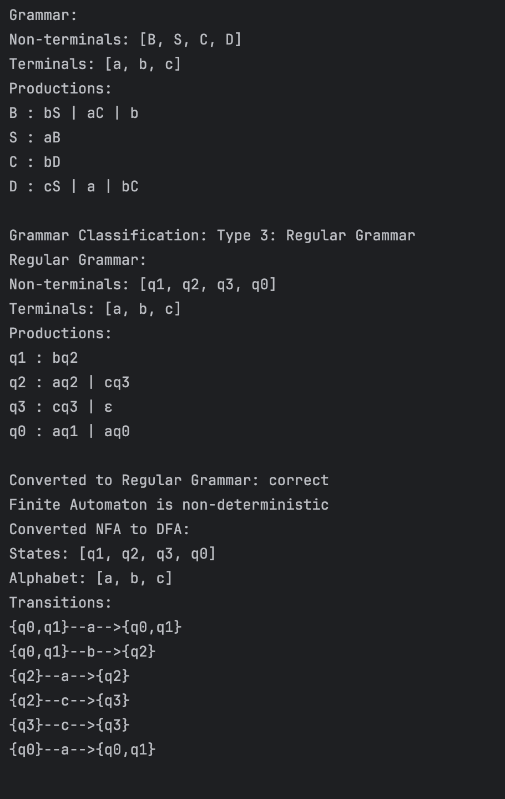
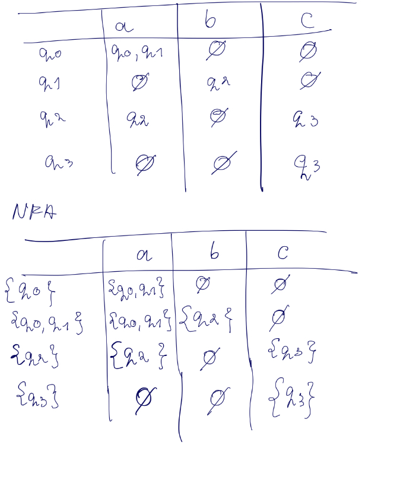
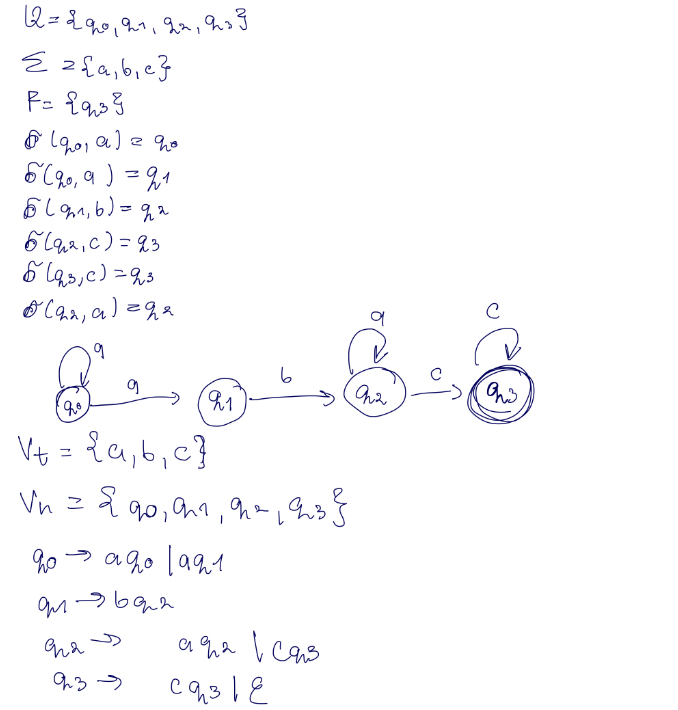

# LAB 2 : Finite Automata

### Course: Formal Languages & Finite Automata
### Author: Victoria Mutruc

----

## Theory

### What is a Finite Automaton?

A **Finite Automaton (FA)** is a mathematical model used to represent and recognize patterns within input. 

1. **States**: A finite set of states, including one starting state and one or more accepting states.
2. **Alphabet**: A finite set of symbols that the automaton can read (i.e., the input symbols).
3. **Transitions**: A set of rules that describe how the automaton moves from one state to another upon reading an input symbol.
4. **Start State**: The state where the automaton begins processing the input.
5. **Final States**: A subset of the states that determine whether the automaton accepts the input string

Finite automata are used in many applications, such as text processing, lexical analysis, and network protocol design.

---

### Types of Finite Automata

There are two main types of finite automata:

#### 1. **Deterministic Finite Automaton (DFA)**
A **DFA** is a type of finite automaton where, for each state, there is exactly one transition for each symbol in the alphabet. The machine operates deterministically, meaning that for any input, the next state is uniquely determined. This is the classical form of finite automaton, where each step is predictable.

- **Properties**:
    - For each state and input symbol, there is exactly one transition.
    - Can be represented as a directed graph where nodes are states and edges are transitions.

#### 2. **Nondeterministic Finite Automaton (NFA)**
An **NFA** is a more flexible form of finite automaton. In an NFA, for each state and input symbol, there can be multiple possible next states (or none at all). The machine can move to any of these states, including the possibility of epsilon transitions (transitions without consuming any input).

- **Properties**:
    - For each state and input symbol, there can be multiple transitions, or even none.
    - Can have epsilon (ε) transitions, where the machine transitions between states without consuming any input symbol.
    - While NFAs are more powerful in terms of their flexibility, they are equivalent in terms of the languages they can recognize to DFAs (every NFA can be converted to an equivalent DFA, though the DFA may have more states).

### Conversion from NFA to DFA
An NFA can be converted into an equivalent DFA using the **subset construction**. The key idea is to represent each set of states in the NFA as a single state in the DFA. The DFA's transitions are then derived from the possible combinations of NFA states.

---

### Chomsky Hierarchy of Grammars

The **Chomsky Hierarchy** is a classification of formal grammars based on their generative power, introduced by linguist **Noam Chomsky** in 1956. It consists of four levels, each representing a different class of grammars and the type of languages they can generate. From the most general to the most restrictive, the levels are:

#### 1. **Type 0: Unrestricted Grammar**
- **Description**: The most general type of grammar, also known as **Turing Machines** or **recursively enumerable languages**.
- **Production Rules**: There are no restrictions on the form of production rules. They can be of the form **α → β**, where **α** and **β** are strings of variables and terminals.

#### 2. **Type 1: Context-Sensitive Grammar (CSG)**
- **Description**: A more restrictive class of grammars, also known as **context-sensitive languages**.
- **Production Rules**: The production rules are of the form **α → β**, where the length of **α** is less than or equal to the length of **β** (i.e., the left-hand side cannot be shorter than the right-hand side).

#### 3. **Type 2: Context-Free Grammar (CFG)**
- **Description**: A more restrictive class that generates **context-free languages**, commonly used to describe programming languages and certain aspects of natural languages.
- **Production Rules**: The production rules are of the form **A → β**, where **A** is a single nonterminal, and **β** is a string of terminals and nonterminals.

#### 4. **Type 3: Regular Grammar**
- **Description**: The most restrictive class of grammars, generating **regular languages**.
- **Production Rules**: The production rules are of the form **A → aB** or **A → a**, where **A** and **B** are nonterminals and **a** is a terminal. Regular grammars are closely related to finite automata.
---


## Objectives:

1. Understand what an automaton is and what it can be used for.

2. Continuing the work in the same repository and the same project, the following need to be added:
   a. Provide a function in your grammar type/class that could classify the grammar based on Chomsky hierarchy.

   b. For this you can use the variant from the previous lab.

3. According to your variant number (by universal convention it is register ID), get the finite automaton definition and do the following tasks:

   a. Implement conversion of a finite automaton to a regular grammar.

   b. Determine whether your FA is deterministic or non-deterministic.

   c. Implement some functionality that would convert an NDFA to a DFA.


4. Implement the laboratory work for the following variant:
   ```
   Variant 21
    Q = {q0,q1,q2,q3},
    ∑ = {a,b,c},
    F = {q3},
    δ(q0,a) = q0,
    δ(q0,a) = q1,
    δ(q1,b) = q2,
    δ(q2,c) = q3,
    δ(q3,c) = q3,
    δ(q2,a) = q2.


## Implementation description

### The ```classifyGrammar``` method

*   The method begins by checking if the grammar is right-regular or left-regular using two helper methods (```isRightRegularGrammar``` and ```isLeftRegularGrammar```). It stores the results as boolean values.

       ```java
        boolean isRightRegular = isRightRegularGrammar();
        boolean isLeftRegular = isLeftRegularGrammar();
      
       ```  

*   Next, it checks if the grammar is either right-regular or left-regular. If either condition is true, it classifies the grammar as "Type 3: Regular Grammar."
    ```java
    if (isRightRegular || isLeftRegular) {
        return "Type 3: Regular Grammar";
    }
    ```
 
*   If neither right-regular nor left-regular is found, the method proceeds to check if the grammar is context-free using the ```isContextFreeGrammar``` helper method. If true, it classifies the grammar as "Type 2: Context-Free Grammar."
    ```java
    else if (isContextFreeGrammar()) {
        return "Type 2: Context-Free Grammar";
    }
  
    ```
*   If the grammar is not context-free, the method checks if it qualifies as context-sensitive grammar using the ```isContextSensitiveGrammar``` method. If true, the grammar is classified as "Type 1: Context-Sensitive Grammar." 
    ```java
    else if (isContextSensitiveGrammar()) {
    return "Type 1: Context-Sensitive Grammar";
    }
    ```
*   Finally, if the grammar does not meet any of the above conditions, it classifies the grammar as "Type 0: Unrestricted Grammar."
    ```java
    else {
    return "Type 0: Unrestricted Grammar";
    }
    ```

### The ```isRightRegular``` method
*   This method checks if the given grammar is right-regular. It loops through each production rule in the grammar (denoted by ```P```), checking that the left side of the production is a non-terminal.
       ```java
       for (Map.Entry<String, Set<String>> entry : P.entrySet()) {
        String leftSide = entry.getKey();
        Set<String> rightSides = entry.getValue();
        
        // left side must be a non-terminal
        if (!V_n.contains(leftSide)) {
            return false;
        }
    }
       
       ```
*   The method then checks each right-hand side of the production rule. It verifies that:
    - Empty string (ε) is allowed.
    ```java
        for (String rightSide : rightSides) {
        if (rightSide.equals("ε")) {
            continue;
        }
    ```
    - If the right side consists only of terminals, it is considered valid.
    ```java
    
        boolean validRightSide = false;
        
        // check for only terminals
        boolean onlyTerminals = true;
        for (int i = 0; i < rightSide.length(); i++) {
            String symbol = rightSide.substring(i, i + 1);
            if (!V_t.contains(symbol)) {
                onlyTerminals = false;
                break;
            }
        }
    ```
    - If the right side consists of a terminal followed by a non-terminal, it must adhere to the format (terminal first, followed by non-terminal).
    
    ```java
    if (onlyTerminals) {
            validRightSide = true;
        } else {
            // terminal followed by non-terminal
            for (String nonTerminal : V_n) {
                if (rightSide.endsWith(nonTerminal)) {
                    // valid terminal followed by non-terminal
                }
            }
        }
    }


*   If any right-hand side does not conform to the valid format, the method returns ```false```, indicating the grammar is not right-regular.
    ```java
    if (!validRightSide) {
    return false;
    }
    ```
### The ```isLeftRegularMethod``` method

*   This method works similarly to ```isRightRegularGrammar```, but checks for left-regular grammar. It ensures that the left side of each production rule is a non-terminal.
       ```java
        for (Map.Entry<String, Set<String>> entry : P.entrySet()) {
        String leftSide = entry.getKey();
        Set<String> rightSides = entry.getValue();
    
        // left side must be a non-terminal
        if (!V_n.contains(leftSide)) {
            return false;
        }
    }
       ```
*   It then verifies that each right side is either:
    - Only terminals.

    ```java
    for (String rightSide : rightSides) {
        if (rightSide.equals("ε")) {
        continue;
        }
    
        boolean validRightSide = false;
    
        boolean onlyTerminals = true;
        for (int i = 0; i < rightSide.length(); i++) {
            String symbol = rightSide.substring(i, i + 1);
            if (!V_t.contains(symbol)) {
                onlyTerminals = false;
                break;
            }
        }
    ```

    - A non-terminal followed by terminals.
    
    ```java

    if (onlyTerminals) {
        validRightSide = true;
    } else {
        // non-terminal followed by terminals
        for (String nonTerminal : V_n) {
            if (rightSide.startsWith(nonTerminal)) {
                // valid non-terminal followed by terminals
            }
        }
    }
    }
    ```
*   If any of the right-hand sides are invalid, the method returns ```false```.
    ```java
    if (!validRightSide) {
        return false;
    }
    
    ```

### The ```isContextFreeGrammar``` method
*   This method checks if the grammar is context-free. It verifies that each production rule has a left-hand side consisting of a single non-terminal
       ```java
       for (Map.Entry<String, Set<String>> entry : P.entrySet()) {
        String leftSide = entry.getKey();
    
        // left side must be a single non-terminal
        if (!V_n.contains(leftSide)) {
            return false;
            }
        }
       ```

*   If all left-hand sides conform to the rule, the method returns ```true```, indicating the grammar is context-free.
       ```java
       return true;
       ```

### The ```isContextSensitiveGrammar``` method
* This method checks if the grammar is context-sensitive. It verifies that for each production rule, the length of the left side is less than or equal to the length of the right side (except when the production is S → ε).
    ```java
    for (Map.Entry<String, Set<String>> entry : P.entrySet()) {
    String leftSide = entry.getKey();
    Set<String> rightSides = entry.getValue();

    for (String rightSide : rightSides) {
        // exception: S → ε is allowed
        if (leftSide.equals("S") && rightSide.equals("ε")) {
            continue;
        }

        // |α| ≤ |β| for non-ε rules
        if (leftSide.length() > rightSide.length() && !rightSide.equals("ε")) {
            return false;
        }
    }
    }
    ```
*   If any rule violates the length condition, the method returns ```false```. If all rules conform, it returns ```true```.
    ```java
    return true;
    ```

### The ```convertToRegularGrammar()``` method
This method converts a finite automaton (FA) to a regular grammar. The regular grammar is represented by a set of productions, non-terminals, terminals, and the initial start state.

* **Step 1: Non-terminals Initialization** : The non-terminals in the grammar correspond to the states of the finite automaton. A set of non-terminals is initialized with all states in the automaton.
    ```java
    Set<String> nonTerminals = new HashSet<>(states);
    ```
* **Step 2: Terminals Initialization** : The terminals correspond to the alphabet of the automaton. The method collects all alphabet symbols and converts them to strings (if needed).
    ```java
    Set<String> terminals = alphabet.stream().map(String::valueOf).collect(Collectors.toSet());
    ```
* **Step 3: Productions Creation** : The method loops through all states and creates productions for each state. If there are transitions for a given state and input symbol, it generates productions where the left-hand side is the state and the right-hand side is a terminal followed by a state. If a state is final, it generates an epsilon (ε) production.
    ```java
    Map<String, Set<String>> productions = new HashMap<>();
    for (String state : states) {
        Set<String> stateProductions = new HashSet<>();
        if (transitions.containsKey(state)) {
            for (Map.Entry<Character, Set<String>> entry : transitions.get(state).entrySet()) {
                char symbol = entry.getKey();
                String terminal = String.valueOf(symbol);
                    for (String nextState : entry.getValue()) {
                        stateProductions.add(terminal + nextState);
                    }
            }
        }
        if (finalStates.contains(state)) {
            stateProductions.add("ε");
        }
    }
    ```
* **Step 4: Return the Grammar** : The method returns the grammar object containing the productions, non-terminals, and terminals.
    ```java
    grammar.setP(productions);
    return grammar;
    ```

### The ```isDeterministic()``` method
This method checks whether the finite automaton is deterministic (DFA) or nondeterministic (NFA). An automaton is deterministic if, for each state and input symbol, there is at most one transition to another state.
*   **Step 1: Iterate Through States and Symbols** : For each state in the automaton, the method checks each input symbol in the alphabet.
    ```java
    for(String state : states) {
    if(transitions.containsKey(state)) {
        for(char symbol : alphabet) {
    ```
*  **Step 2: Check Multiple Transitions for a Symbol** : If a state has more than one transition for the same symbol, the automaton is nondeterministic, and the method returns false.
    ```java
    if(transitions.get(state).containsKey(symbol) && transitions.get(state).get(symbol).size() > 1) {
    return false;
    }
    ```
*  **Step 3: Return Determinism Status** : If no state violates the deterministic condition, the method returns true, indicating the automaton is deterministic.
    ```java
    return true;
    ```

### The ```convertToDFA()``` method
This method converts the given Nondeterministic Finite Automaton (NFA) to a Deterministic Finite Automaton (DFA) using the subset construction (powerset construction) algorithm.

* **Step 1: Initialize the DFA** : The method initializes the DFA with an empty alphabet and sets the starting state.
    ```java
    FiniteAutomaton dfa = new FiniteAutomaton();
    dfa.setAlphabet(new HashSet<>(alphabet));
    ```

* **Step 2: Epsilon Closure for Initial State** : The epsilon closure of the NFA start state is computed. The start state of the DFA is assigned based on this epsilon closure.
    ```java
    Set<String> initialStateSet = epsilonClosure(Collections.singleton(startState));
    String initialStateName = "q0";
    stateNameMap.put(initialStateSet, initialStateName);
    reverseStateNameMap.put(initialStateName, initialStateSet);
    ```
*  **Step 3: Process States** : The algorithm processes each state in the DFA using a queue to keep track of newly discovered states. For each state, the method iterates over all input symbols, computes the resulting states, and adds transitions to the DFA.
    ```
    Queue<Set<String>> stateQueue = new LinkedList<>();
    stateQueue.add(initialStateSet);
    Set<Set<String>> processedStates = new HashSet<>();
    ```
   
*  **Step 4: Check Final States** : The method checks if any state in the DFA corresponds to a final state in the NFA. If so, it marks that state as a final state in the DFA.
    ```java
    boolean isFinal = false;
    for (String state : initialStateSet) {
    if (finalStates.contains(state)) {
    isFinal = true;
    break;
    }
    }
    if (isFinal) {
    dfa.addFinalState(initialStateName);
    }
    ```

*  **Step 5: State Transitions** : The method uses the ```move()``` function to find the next set of states for a given symbol and adds the transitions to the DFA. If the resulting state set is not already present in the DFA, a new state is created and added.
    ```java
    for (char symbol : alphabet) {
    Set<String> nextStateSet = move(currentStateSet, symbol);
    if (!nextStateSet.isEmpty()) {
        String nextStateName;
        if (!stateNameMap.containsKey(nextStateSet)) {
            nextStateName = "q" + stateCounter++;
            stateNameMap.put(nextStateSet, nextStateName);
            reverseStateNameMap.put(nextStateName, nextStateSet);
            dfa.addState(nextStateName);
            boolean containsFinal = false;
            for (String state : nextStateSet) {
                if (finalStates.contains(state)) {
                    containsFinal = true;
                    break;
                }
            }
            if (containsFinal) {
                dfa.addFinalState(nextStateName);
            }
            stateQueue.add(nextStateSet);
        } else {
            nextStateName = stateNameMap.get(nextStateSet);
        }
        dfa.addTransition(stateNameMap.get(currentStateSet), symbol, nextStateName);
        }
    }
    ```

*  **Step 6: Return DFA** : The method returns the newly created DFA.
    ```java
    dfa.setStateToNfaStatesMap(reverseStateNameMap);
    return dfa;
    ```

### The ```move()``` method
This helper method computes the set of states that can be reached from a set of states on a given input symbol. It simulates the transition function for a set of states.
*   **Step 1: Loop Through States**: For each state in the input set, the method checks if a transition exists for the given symbol.
    ```java
    for (String state : states) {
        if (transitions.containsKey(state) && transitions.get(state).containsKey(symbol)) {
            result.addAll(transitions.get(state).get(symbol));
        }
    }
    ```
*   **Step 2: Return Result** : The method returns the set of states reachable from the given states on the input symbol.
    ```java
    return result;
    ```

### The ```epsilonClosure()``` method
This helper method computes the epsilon closure of a given set of states. In this case, it is a simple placeholder method, which returns the set of states without any changes, assuming no epsilon transitions are present.
* **Step 1: Return Input States** : The method returns the same set of states passed as input.
    ```java
    return new HashSet<>(states);
    ```

## Results
In the output, we are presented with the details of a grammar that includes non-terminals [B, S, C, D] and terminals [a, b, c], along with the corresponding production rules. The grammar is classified as a Type 3 Regular Grammar. The FA that is provided in the variant is then shown as a regular grammar with non-terminals [q1, q2, q3, q0] and terminals [a, b, c], along with its production rules. 



The conversion of the given FA to a regular grammar is confirmed as correct. The program then identifies that the finite automaton (FA) is non-deterministic (NFA) and converts it to a deterministic finite automaton (DFA).
The output shows the state transitions of the DFA, such as {q0, q1} --a--> {q0, q1}, {q0, q1} --b--> {q2}, and others, demonstrating the automaton's behavior.



<em>Manual Conversion of NFA to DFA</em>



<em>Manual Conversion of FA to Regular Grammar</em>

I have also implemented the conversion of the **FA** to a **Regular Grammar** manually. As we can observe, the results I obtained through manual calculation are the same as the results obtained through the program.

## Conclusions
Through this lab, I gained a deeper understanding of automata, particularly focusing on converting a non-deterministic finite automaton (NFA) to a deterministic finite automaton (DFA). I also worked on classifying grammars based on the Chomsky hierarchy and converting a finite automaton into a regular grammar. One of the main challenges I faced during the NFA to DFA conversion was dealing with the process of grouping multiple NFA states into a single DFA state. This was difficult because when converting to a DFA, I needed to account for every possible combination of NFA states and ensure that each combination was mapped correctly to a unique DFA state.
Initially, I encountered issues with handling these groups of states properly, which led to some incorrect or missing transitions in the DFA. I managed to overcome these difficulties by further studying the documentation. This experience helped me better understand the theoretical foundations of automata and the practical aspects of implementing algorithms to convert, classify, and manipulate them, which has deepened my knowledge of formal languages and computation.

## References
1. GeeksforGeeks. *Convertion from NFA to DFA*. Available at: [https://www.geeksforgeeks.org/conversion-from-nfa-to-dfa/](https://www.geeksforgeeks.org/map-interface-java-examples/)
2. GeeksforGeeks. *Chomsky Hierarchy in Theory of Computation*. Available at: [https://www.geeksforgeeks.org/chomsky-hierarchy-in-theory-of-computation/](https://www.geeksforgeeks.org/set-in-java/)