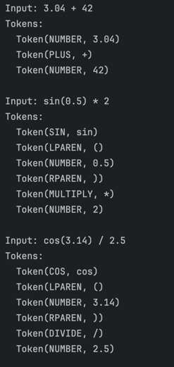
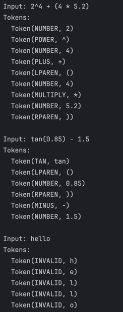

# LAB 3 : Lexer & Scanner

### Course: Formal Languages & Finite Automata
### Author: Victoria Mutruc

----

## Theory

Lexical analysis is a crucial step in the compilation or interpretation of programming languages, markup languages, and other structured text formats. It represents the process of converting a raw sequence of characters into meaningful components called **tokens**. The mechanism responsible for this process is known as a **lexer**, which is sometimes also referred to as a tokenizer or scanner.

Lexical analysis serves as the first stage in a compiler or interpreter. It simplifies subsequent processing by breaking down an input stream of characters into structured elements. Additionally, it removes unnecessary characters such as whitespace and comments, and helps detect malformed sequences early in the process, thereby preventing errors in later compilation stages.

A lexeme is a sequence of characters from the input that form a meaningful unit based on predefined rules of the language. For example, in a programming language, words like "if," "while," "return," and symbols such as "+," "=," and "{}" are all lexemes. However, lexemes alone are not sufficient for further processing, which is where tokens come into play.

A token provides a structured representation of a lexeme. It consists of two main components: a token type, which categorizes the lexeme (such as keyword, identifier, number literal, or operator), and optional metadata, such as the actual value of the lexeme. For instance, if the input code contains the statement "int x = 10;" the lexer would generate tokens for the keyword "int," the identifier "x," the assignment operator "=," the number literal "10," and the semicolon ";."

The lexer follows predefined rules, often expressed using regular expressions or finite state machines, to identify and categorize lexemes. These rules define the patterns that determine whether a sequence of characters belongs to a specific token type.

## Objectives:
1. Understand what lexical analysis is.
2. Get familiar with the inner workings of a lexer/scanner/tokenizer.
3. Implement a sample lexer for a calculator and show how it works.


## Implementation description

### The ```matchNumber``` method

* At the beginning of the method, a check is performed to determine if there are characters left to process and whether the current character is a digit. If the input is exhausted or does not start with a digit, the method immediately returns null, indicating that no valid number was found.

   ```java
   if (position >= input.length() || !Character.isDigit(getCurrentChar())) {
    return null;
    }
   ```

* Once the method confirms that a number may be present, it initializes two variables. The variable ```start``` stores the initial position of the number in the input string, which helps extract the final result. The boolean flag ```hasDecimal``` is used to track whether a decimal point (.) has been encountered. This ensures that a valid floating-point number is processed correctly and that multiple decimal points are not allowed.
    ```java
    int start = position;
    boolean hasDecimal = false;
   ```
* The method then enters a loop to process the number. The loop continues as long as the current character is either a digit (0-9) or a decimal point (.). If a decimal point is encountered, the method checks whether one has already been found. If so, it breaks out of the loop, preventing invalid numbers like "12.34.56" from being processed. If the decimal point is valid, the ```hasDecimal``` flag is set to ```true```, allowing the loop to continue parsing the rest of the number. The ```advance()``` method is called within the loop to move to the next character in the input string.

    ```java
    while (position < input.length() &&
            (Character.isDigit(getCurrentChar()) || getCurrentChar() == '.')) {
        if (getCurrentChar() == '.') {
            if (hasDecimal) {
                break; // second decimal point is not part of this number
            }
            hasDecimal = true;
        }
        advance();
        }
    ```
*  Finally, once the number has been fully processed, it is extracted from the original input string using the stored start position and the final position. This ensures that the method correctly returns either an integer (e.g., "123") or a floating-point number (e.g., "45.67").
    ```java
    return input.substring(start, position);
    ```

### The ```matchKeyword``` method
* At the beginning of the method, a check is performed to determine whether there are enough characters left in the input to match the given keyword. This prevents out-of-bounds errors when attempting to extract a substring. If there are enough characters, the method extracts a substring from the current position with the same length as the keyword and compares it to the expected keyword. If they match, further validation is required to confirm that the match is not part of a longer identifier.
   ```java
  if (position + keyword.length() <= input.length() &&
        input.substring(position, position + keyword.length()).equals(keyword)) {
   ```

* Once a keyword match is found, the method checks whether the character immediately following the keyword is a letter. This ensures that keywords such as "if" are not mistakenly matched inside longer identifiers like "ifCondition". The variable endPos stores the position immediately after the keyword, and if this position is either at the end of the input or followed by a non-letter character, the keyword is confirmed as a valid match.

    ```java
    int endPos = position + keyword.length();
    if (endPos >= input.length() || !Character.isLetter(input.charAt(endPos))) {
    return keyword;
    }
    ```
* If the keyword is properly matched and validated, it is returned. Otherwise, the method returns ```null```, indicating that no valid keyword was found at the current position.

    ```java
    return null;
    ```

### The ```getNextToken``` method

* Before attempting to find the next token, the method first calls ```skipWhitespace()```. This ensures that spaces and other whitespace characters are ignored, allowing proper token extraction.

    ```java
    skipWhitespace();
    ```

* If the position variable has reached or exceeded the length of the input string, it means there are no more characters left to process. In this case, the method returns a special end-of-line token (EOL).

    ```java
    if (position >= input.length()) {
    return new Token(TokenType.EOL, "");
    }
    ```

* The method attempts to match a number using ```matchNumber()```. If a valid number is found, a NUMBER token is created and returned. This ensures that numerical values are correctly identified and processed.

    ```java
    String number = matchNumber();
    if (number != null) {
    return new Token(TokenType.NUMBER, number);
    }
    ```
* The method then checks for specific keywords representing trigonometric functions (sin, cos, and tan). It uses ```matchKeyword()``` to determine if the current position in the input matches any of these functions. If a match is found, it advances the position by three characters (since each function name is three letters long) and returns the corresponding token type.
    
    ```java
    String keyword;
    if ((keyword = matchKeyword("sin")) != null) {
    advance(3);
    return new Token(TokenType.SIN, keyword);
    }
    
    if ((keyword = matchKeyword("cos")) != null) {
    advance(3);
    return new Token(TokenType.COS, keyword);
    }
    
    if ((keyword = matchKeyword("tan")) != null) {
    advance(3);
    return new Token(TokenType.TAN, keyword);
    }
    ```

* If none of the previous checks succeed, the method assumes that the next token is a single-character symbol. It retrieves the current character, advances the position, and then uses a switch statement to determine the corresponding token type.

    ```java
    char currentChar = getCurrentChar();
    advance();
    ```

* The method then maps common mathematical operators and parentheses to their respective token types. If the character does not match any known symbols, an INVALID token is returned, ensuring that unrecognized characters are properly flagged.

    ```java
    switch (currentChar) {
    case '+': return new Token(TokenType.PLUS, "+");
    case '-': return new Token(TokenType.MINUS, "-");
    case '*': return new Token(TokenType.MULTIPLY, "*");
    case '/': return new Token(TokenType.DIVIDE, "/");
    case '^': return new Token(TokenType.POWER, "^");
    case '(': return new Token(TokenType.LPAREN, "(");
    case ')': return new Token(TokenType.RPAREN, ")");
    default:  return new Token(TokenType.INVALID, String.valueOf(currentChar));
    }
    ```
  
### The ```tokenize``` method
* At the beginning of the method, a list named ```tokens``` is created to store the extracted tokens. Additionally, a Token variable is declared, which will be used to store each token as it is retrieved from ```getNextToken()```.

    ```java
    List<Token> tokens = new ArrayList<>();
    Token token;
    ```

* Before starting the tokenization process, the ```position``` variable is reset to ```0```. This ensures that the tokenization always starts from the beginning of the input string, preventing issues if the method is called multiple times on the same object.

    ```java
    position = 0;
    ```

* The method enters a loop that repeatedly calls ```getNextToken()```. Each retrieved token is checked to see if its type is EOL (end of input). If it is not EOL, the token is added to the ```tokens``` list. This process continues until all tokens have been extracted.

    ```java
    while ((token = getNextToken()).getType() != TokenType.EOL) {
    tokens.add(token);
    }
    ```

* Once all tokens have been collected, the method returns the ```tokens``` list, which contains a sequential representation of the input in token form.
    ```java
    return tokens;
    ```

### The ```skipWhitespace``` Method
* The skipWhitespace method is responsible for advancing the position in the input string while skipping over any whitespace characters. It ensures that spaces, tabs, or other blank characters do not interfere with token recognition. The method operates using a while loop that continues as long as the current position is within the input bounds and the character at that position is a whitespace character. If a whitespace is detected, the ```advance()``` method is called to move to the next character. This process repeats until a non-whitespace character is found or the end of the input is reached. By removing unnecessary whitespace before token extraction, this method helps streamline the lexical analysis process and ensures that tokens are correctly identified without being affected by spacing inconsistencies.

    ```java
    while (position < input.length() && Character.isWhitespace(getCurrentChar())) {
        advance();
    }
    ```
  
### The ```getCurrentChar``` Method
* The ```getCurrentChar``` method retrieves the character at the current position in the input string. It ensures that access to the input does not go out of bounds by checking whether the position is within the valid range. If the ```position``` is less than the length of the input, it returns the character at that position using ```input.charAt(position)```. Otherwise, it returns the null character (```\0```), indicating that the end of the input has been reached. This method is crucial for safely reading characters during lexical analysis without causing index errors.

    ```java
    return (position < input.length()) ? input.charAt(position) : '\0';
    ```

### The ```TokenType``` Enum

* The TokenType enum defines the various token types that the lexer can recognize and categorize during the tokenization process. Each token type corresponds to a specific kind of input symbol or structure found in a mathematical expression. This enum helps to standardize the token types and ensures that each part of the input is categorized correctly during lexical analysis.

    * ```NUMBER```: Represents integers and floating-point numbers. These can be values like 3, 42.5, etc.
    * ```PLUS```: Represents the addition operator +. 
    * ```MINUS```: Represents the subtraction operator -. 
    * ```MULTIPLY```: Represents the multiplication operator *. 
    * ```DIVIDE```: Represents the division operator /. 
    * ```LPAREN```: Represents the left parenthesis (. 
    * ```RPAREN```: Represents the right parenthesis ). 
    * ```SIN```: Represents the sin trigonometric function. 
    * ```COS```: Represents the cos trigonometric function. 
    * ```TAN```: Represents the tan trigonometric function. 
    * ```POWER```: Represents the exponentiation operator ^ for raising a number to a power. 
    * ```EOL```: Represents the end of the line or input. 
    * ```WHITESPACE```: Represents spaces and tabs that are ignored during tokenization. 
    * ```INVALID```: Represents any invalid or unrecognized token that does not match any valid token type. 
  
## Results
The tokenization process for the given inputs was successful, as this lexer is designed for a simple calculator and handles mathematical expressions effectively.

* Input 1 : ```3.04 + 42```

  The lexer correctly identified ```3.04``` as a ```NUMBER```, the ```+``` operator as ```PLUS```, and ```42 ```as another valid ```NUMBER```. This input was tokenized as expected, with no issues.
* Input 2 : ```sin(0.5) * 2```

  The lexer successfully identified the trigonometric function ```sin``` as a ```SIN``` token, with the parentheses correctly recognized as ```LPAREN``` and ```RPAREN```. The number ```0.5``` was tokenized as a ```NUMBER```, and the multiplication operator ```*``` was correctly classified as ```MULTIPLY```. Finally, the number ```2``` was tokenized as a ```NUMBER```. This input was tokenized without any issues.

* Input 3: ```cos(3.14) / 2.5```
  Similarly, the lexer correctly recognized ```cos``` as a ```COS``` function, and the parentheses were tokenized as ```LPAREN``` and ```RPAREN```. Both ```3.14``` and ```2.5``` were correctly identified as ```NUMBER ```tokens, and the division operator ```/``` was correctly classified as ```DIVIDE```. This input was tokenized as expected.
    
* Input 4: ```2^4 + (4 * 5.2)```

  In this case, the lexer correctly identified the numbers ```2``` and ```4``` as ```NUMBER``` tokens, and the ```^``` operator as ```POWER```. The ```+``` operator was correctly tokenized as ```PLUS```, and the parentheses as ```LPAREN``` and ```RPAREN```. The multiplication operator ```*``` was correctly recognized, and the number ```5.2``` was identified as a ```NUMBER```. This input was tokenized accurately.
* Input 5: ```tan(0.85) - 1.5```

  The lexer correctly identified the ```tan``` function as ```TAN```, with the parentheses correctly tokenized as ```LPAREN``` and ```RPAREN```. The number ```0.85``` was tokenized as a ```NUMBER```, and the ```-``` operator was correctly classified as ```MINUS```. Finally, the number ```1.5``` was correctly identified as a ```NUMBER```. This input was tokenized without errors.
* Input 6: ```hello```

  Since this lexer is designed for a calculator, any unrecognized input, such as hello, will be broken down into invalid tokens. The lexer incorrectly split the word hello into individual characters (h, e, l, l, o), each categorized as ```INVALID```.





## Conclusions
Through this lab, I learned the fundamentals of lexical analysis, how a lexer processes input, and how to implement a basic tokenizer for a calculator. One of the main challenges I faced was correctly parsing the input, as handling different token types and ensuring proper tokenization required careful design. Overcoming this challenge helped me develop a deeper understanding of how lexers break down input streams into meaningful tokens, reinforcing my knowledge of lexical analysis and its role in language processing.

## References
1. LLVM. *Kaleidoscope: Kaleidoscope Introduction and the Lexer*. Available at: [https://llvm.org/docs/tutorial/MyFirstLanguageFrontend/LangImpl01.html](https://llvm.org/docs/tutorial/MyFirstLanguageFrontend/LangImpl01.html)
2. Wikipedia. *Lexical Analysis*. Available at: [https://en.wikipedia.org/wiki/Lexical_analysis](https://en.wikipedia.org/wiki/Lexical_analysis)