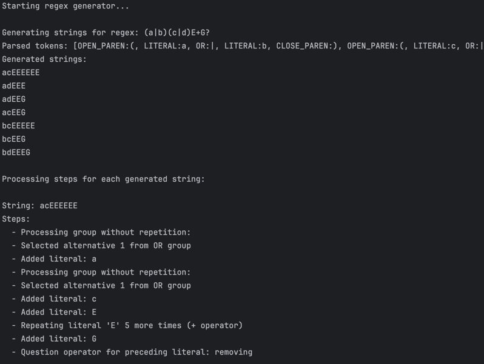
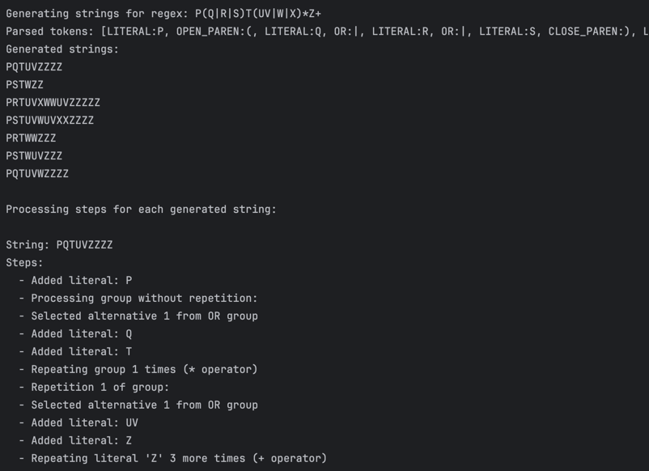
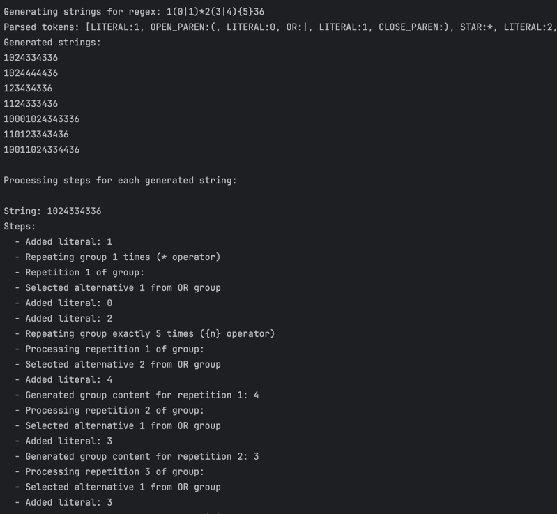

# LAB 4 : Regular expressions

### Course: Formal Languages & Finite Automata
### Author: Victoria Mutruc

----

## Theory
Regular expressions (regex) are powerful tools used in programming and text processing to define search patterns for matching and manipulating strings. Regular expressions are used in various applications such as data validation, pattern recognition, and text processing. They are commonly used in programming, search engines, and data analysis to efficiently filter, extract, and modify strings based on defined patterns.
A regex pattern consists of a combination of characters and special symbols that define a structured way to search for or validate text.
The ```{n}``` syntax specifies that the preceding character or group must appear exactly n times, ensuring precise control over repetition. Similarly, ```{n,m}``` allows a range, meaning the pattern must appear at least n times but no more than m times. The ```|``` symbol represents alternation, acting as an "or" operator, allowing a match with either one pattern or another. The ```+``` operator ensures that the preceding character or group appears at least once but can repeat indefinitely. In contrast, ```*``` allows zero or more occurrences, meaning the pattern may be absent or appear multiple times. The ```?``` symbol makes the preceding element optional, allowing it to appear once or not at all. These symbols help define flexible and powerful search patterns, making regex useful for validation, searching, and text processing. Understanding how to use these operators correctly is essential for constructing efficient expressions.

## Objectives:
1. Write and cover what regular expressions are, what they are used for;

2. Below you will find 3 complex regular expressions per each variant. Take a variant depending on your number in the list of students and do the following:

    a. Write a code that will generate valid combinations of symbols conform given regular expressions (examples will be shown). Be careful that idea is to interpret the given regular expressions dinamycally, not to hardcode the way it will generate valid strings. You give a set of regexes as input and get valid word as an output

    b. In case you have an example, where symbol may be written undefined number of times, take a limit of 5 times (to evade generation of extremely long combinations);

    c. Bonus point: write a function that will show sequence of processing regular expression (like, what you do first, second and so on)

3. Implement the regex expressions from variant 1:
    ```
    (a|b)(c|d)E+G?
    P(Q|R|S)T(UV|W|X)*Z+
    1(0|1)*2(3|4){5}36
    ```

## Implementation description

### The ```generate``` method
* The `generate` method is responsible for producing a list of unique generated strings.
It takes an integer `count`, which specifies the number of unique strings to generate.

* At the beginning of the method, an empty list `generatedStrings` is created to store the results. The `allProcessingSteps` map is cleared to ensure that no previous processing data remains.
    ```java
    List<String> generatedStrings = new ArrayList<>();
    allProcessingSteps.clear();
    ```

* The method then enters a loop that runs up to `count * 2` iterations or until the required number of unique strings have been generated. This allows additional attempts in case some generated strings are duplicates.

    ```java
    for (int i = 0; i < count * 2 && generatedStrings.size() < count; i++) {
    ```

* Inside the loop, a new list `currentSteps` is initialized to track the processing steps for the current generation attempt. The `generateFromTokens` method is then called, which attempts to create a new string based on the tokenized input.

    ```java
       currentSteps = new ArrayList<>();
       String generated = generateFromTokens(0, tokens.size());
    ```
  
* If the generated string is valid (i.e., not `null`, not empty, and not already in the list), it is added to `generatedStrings`, and its associated processing steps are stored in `allProcessingSteps`. This ensures uniqueness and allows tracking of how each string was generated.

    ```java
    if (generated != null && !generated.isEmpty() && !generatedStrings.contains(generated)) {
        generatedStrings.add(generated);
        allProcessingSteps.put(generated, new ArrayList<>(currentSteps));
    }
    ```

* Finally, once the loop has completed, the method returns the list of generated strings. This ensures that the requested number of unique strings is provided.

    ```java
    return generatedStrings;
    ```


### The ```generateFromTokens``` method
* The method starts by creating a StringBuilder to store the result. It then iterates over the token list within the specified range ```[startIndex, endIndex]```.
    ```java
    StringBuilder result = new StringBuilder();

    for (int i = startIndex; i < endIndex && i < tokens.size(); i++) {
        Token token = tokens.get(i);
    ```

* If a token is of type ```LITERAL```, its value is appended to the result. A processing step is recorded to track the addition of the literal.
    ```java
    case LITERAL:
    result.append(token.getValue());
    addStep("Added literal: " + token.getValue());
    break;
    ```
* When encountering an ```OPEN_PAREN```, the method locates the corresponding closing parenthesis. If no matching closing parenthesis is found, an error is recorded, and ```null``` is returned.
    ```java
    int closeIndex = findMatchingCloseParen(i);
    if (closeIndex == -1) {
        addStep("Error: Missing closing parenthesis");
        return null;
    }
    ```
* If a valid group is found, the method checks for repetition operators (+, *, ?, {n,m}). Depending on the operator, the group is processed and repeated accordingly.
    ```java
    if (nextToken.getType() == TokenType.PLUS) {
        int repetitions = random.nextInt(maxIterations) + 1;
        addStep("Repeating group " + repetitions + " times (+ operator)");
    ```
* If a literal is followed by a +, it is repeated at least once. If followed by *, it is repeated zero or more times. If followed by ?, it may be included or omitted based on a random decision.
    ```java
    case PLUS:
        if (i > 0 && tokens.get(i-1).getType() == TokenType.LITERAL) {
        int repetitions = random.nextInt(maxIterations) + 1;
        addStep("Repeating literal '" + literal + "' " + repetitions + " times (+ operator)");
        }
    break;
    ```
* If a literal is followed by {n} or {n,m}, the method extracts the values and repeats the literal accordingly. This method ensures that repetitions fall within the specified range.
    ```java
    case REPEAT_START:
        if (i > 0 && tokens.get(i-1).getType() == TokenType.LITERAL) {
            int n = Integer.parseInt(tokens.get(j).getValue());
            int m = n;
    
    ```

* After processing all tokens within the given range, the method returns the final constructed string. This ensures that the method begins parsing the numeric values inside {} immediately.
    ```java
    return result.toString();
    ```

### The ```handleRepetition``` method

* The method starts by setting the ```currentIndex``` to the position after the {, which follows the closing parenthesis of a grouped expression.
    ```java
    int currentIndex = closeParenIndex + 2; 
    ```
* This part then checks if the next token is a number, which represents the minimum number of times the preceding group should be repeated. If found: It sets minRepeat and maxRepeat to this value (defaulting to exactly n repetitions). It then advances currentIndex to check for further tokens.
    ```java
    if (currentIndex < tokens.size() && tokens.get(currentIndex).getType() == TokenType.NUMBER) {
        int minRepeat = Integer.parseInt(tokens.get(currentIndex).getValue()); // Extract {n}
        int maxRepeat = minRepeat; 
        currentIndex++;
    ```
* The section checks if the next token is a comma, indicating the presence of an upper limit (m). If so: It moves to the next token and extracts m if it is a number, updates maxRepeat to store the upper limit.
    ```java
        if (currentIndex < tokens.size() && tokens.get(currentIndex).getType() == TokenType.COMMA) {
            currentIndex++; 
            if (currentIndex < tokens.size() && tokens.get(currentIndex).getType() == TokenType.NUMBER) {
                maxRepeat = Integer.parseInt(tokens.get(currentIndex).getValue());
                currentIndex++; 
            }
        }
    ```
* The method iterates through the token list until it finds the closing } (TokenType.REPEAT_END). This ensures that it properly identifies the end of the repetition block.
    ```java
        while (currentIndex < tokens.size() && tokens.get(currentIndex).getType() != TokenType.REPEAT_END) {
            currentIndex++;
        }
    
    ```
* If ```maxRepeat``` is greater than ```minRepeat```, a random number of repetitions is chosen between ```minRepeat``` and ```maxRepeat```. Otherwise, the repetition count is exactly ```minRepeat```.
    ```java
    int repetitions = (maxRepeat > minRepeat) ? 
        minRepeat + random.nextInt(maxRepeat - minRepeat + 1) : minRepeat;
    ```

* The method loops through the determined number of repetitions. It calls ```handleOrGroup``` to generate the group content for each repetition. It appends this generated content to the ```result```.
    ```java
    for (int i = 0; i < repetitions; i++) {
        String groupContent = handleOrGroup(openParenIndex + 1, closeParenIndex);
        result.append(groupContent);
    }
    ```
* After processing the repetitions, ```currentIndex``` is returned to indicate the next position in token parsing. If no valid repetition pattern is found, it simply returns ```closeParenIndex```.
    ```java
        return currentIndex;
    }
    return closeParenIndex;
    ```

### The ```handleOrGroup``` method
* The method begins by initializing an ArrayList named ```orPositions``` to store the indices of the "OR" (|) token positions. It first adds the ```startIndex - 1```, which marks the position before the group starts (useful for handling the first alternative correctly).
    ```java
    List<Integer> orPositions = new ArrayList<>();
    orPositions.add(startIndex - 1);
    ```
* The method then iterates over the range of tokens from ```startIndex``` to ```endIndex``` and checks for the presence of the ```OR``` token type. Every time it encounters an ```OR```, it adds the index of that token to ```orPositions```.
    ```java
    for (int i = startIndex; i < endIndex; i++) {
        if (tokens.get(i).getType() == TokenType.OR) {
            orPositions.add(i); 
        }
    }
    ``` 
* After the loop, the method adds endIndex to ```orPositions```. This represents the end of the group (after the last alternative). This ensures that we can identify the boundary of the final alternative in the ```OR``` group.
    ```java
    orPositions.add(endIndex);
    ```

* The method selects one of the alternatives at random. It generates a random number (randomChoice) between 0 and ```orPositions.size() - 2```, which corresponds to the index of the selected ```OR``` token.
    ```java
    int randomChoice = random.nextInt(orPositions.size() - 1);
    ```
* Then, the method calculates the choiceStart and choiceEnd positions. These represent the boundaries of the randomly selected alternative.
    ```java
    int choiceStart = orPositions.get(randomChoice) + 1; 
    int choiceEnd = orPositions.get(randomChoice + 1); 
    ```
* A logging step is added here using ```addStep```. It records which alternative was selected from the OR group for later debugging or tracking.
    ```java
    addStep("Selected alternative " + (randomChoice + 1) + " from OR group");
    ```
* The method generates content for the selected alternative by calling ```generateFromTokens(choiceStart, choiceEnd)```. This method processes the tokens within the boundaries of the selected alternative and returns the generated content.
    ```java
    return generateFromTokens(choiceStart, choiceEnd);
    ```

### The ```findMatchingCloseParen``` method
* The method starts by initializing a ```level``` variable to 1. This is because the current parenthesis (() at openIndex is already considered open, so the level starts at 1.
    ```java
    int level = 1; 
    ```
* The method then enters a for loop, starting from the token after the openIndex (i.e., openIndex + 1) and continuing through all tokens in the list. The loop checks each token's type and adjusts the level counter based on the type of parenthesis encountered.
    ```java
    for (int i = openIndex + 1; i < tokens.size(); i++) {
                if (tokens.get(i).getType() == TokenType.OPEN_PAREN) {
                    level++;
                }
    ```
  
* If the current token is a closing parenthesis (CLOSE_PAREN), the method decreases the level counter by 1. This indicates that a level of parentheses has been closed.
    ```java
    else if (tokens.get(i).getType() == TokenType.CLOSE_PAREN) {
        level--;
    ```
* When level reaches 0, it means that we have found the closing parenthesis that matches the opening parenthesis at openIndex. The method then returns the current index ```i```, indicating the position of the matching closing parenthesis.
    ```java
    if (level == 0) {
        return i; 
    }
    ```
* If the loop completes without finding a matching closing parenthesis (i.e., if level never reaches 0), the method returns -1. This indicates that there is no matching closing parenthesis for the given opening parenthesis
    ```java
    return -1;
    ```

### The ```parse``` method
* The method starts a while loop that continues as long as position is less than the length of the regex string. Each iteration processes one character from the string.
    ```java
    while (position < regex.length()) {
        char c = regex.charAt(position);
    ```
* If the current character is an opening parenthesis (, it creates a ```Token``` of type ```OPEN_PAREN``` and adds it to the tokens list. The position is then incremented to move past the parenthesis.
    ```java
    if (c == '(') {
        tokens.add(new Token(TokenType.OPEN_PAREN, "("));
        position++;
    }
    ```
* If the current character is a pipe ```|```, it creates a Token of type ```OR``` and adds it to the tokens list. The position is incremented to move past the pipe.
    ```java
    else if (c == '|') {
        tokens.add(new Token(TokenType.OR, "|"));
        position++;
    }
    ```
* The method checks for the characters +, *, and ?, each of which represents a quantifier in regex. Each token is added to the tokens list, and the position is incremented to move past the character.
    ```java
    else if (c == '+') {
        tokens.add(new Token(TokenType.PLUS, "+"));
        position++;
    } else if (c == '*') {
        tokens.add(new Token(TokenType.STAR, "*"));
        position++;
    } else if (c == '?') {
        tokens.add(new Token(TokenType.QUESTION, "?"));
        position++;
    }
    ```
* If the current character is an opening curly brace ```{```, the method begins processing a repetition range (e.g., {n,m}). First, a Token of type ```REPEAT_START``` is created and added to the tokens list. The position is incremented to move past the ```{```. The method then calls ```parseNumber()``` to parse a number that specifies the minimum repetition count. If the next character is a comma ```,```, it indicates a range, so another number is parsed to specify the maximum repetition count. Finally, the method expects a closing curly brace ```}```, creates a Token of type ```REPEAT_END```, and moves past the ```}```.
    ```java
    else if (c == '{') {
        tokens.add(new Token(TokenType.REPEAT_START, "{"));
        position++;
        parseNumber();
        if (position < regex.length() && regex.charAt(position) == ',') {
            tokens.add(new Token(TokenType.COMMA, ","));
            position++;
            parseNumber();
        }
        if (position < regex.length() && regex.charAt(position) == '}') {
            tokens.add(new Token(TokenType.REPEAT_END, "}"));
            position++;
        }
    }
    ```
* If the current character is a whitespace character (space, tab, newline, or carriage return), the method simply skips it by incrementing the position.
    ```java
    else if (c == ' ' || c == '\t' || c == '\n' || c == '\r') {
        position++; 
    }
    ```
* If the character is not one of the special characters (parentheses, operators, or whitespace), it is treated as a literal character (e.g., letters, digits, etc.). The method uses a ```StringBuilder``` to collect all consecutive non-special characters (a sequence of literals). The method continues adding characters to literal until it encounters a special character or the end of the string. Once a literal sequence is formed, it creates a Token of type ```LITERAL``` and adds it to the tokens list.
    ```java
    else {
        StringBuilder literal = new StringBuilder();
        while (position < regex.length() &&
                "(){}|+*? \t\n\r".indexOf(regex.charAt(position)) == -1) {
            literal.append(regex.charAt(position));
            position++;
        }
        if (literal.length() > 0) {
            tokens.add(new Token(TokenType.LITERAL, literal.toString()));
        }
    }
    ```
* Once the entire regex string is processed, the method returns the list of tokens generated from the input string.
    ```java
    return tokens;
    ```

### The ```parseNumber``` method
* A ```StringBuilder``` is initialized to collect the digits as a number is parsed from the regex string.
    ```java
    StringBuilder number = new StringBuilder();
    ```
* The method enters a ```while``` loop that continues as long as ```position``` is within the bounds of the string and the current character is a digit. It appends each digit to the number string and increments the ```position``` to move to the next character.
    ```java
    while (position < regex.length() && Character.isDigit(regex.charAt(position))) {
        number.append(regex.charAt(position));
        position++;
    }
    ```
* Once the loop finishes (either by reaching the end of the string or encountering a non-digit character), the method checks if any digits were collected (i.e., the number length is greater than zero). If a number was found, it creates a Token of type ```NUMBER``` with the string representation of the number and adds it to the tokens list.
    ```java
    if (number.length() > 0) {
        tokens.add(new Token(TokenType.NUMBER, number.toString()));
    }
    ```
## Results

The regular expressions provided are indeed generating the expected outputs, and each step in the generation can be analyzed and visualized as follows:
* First regex ```(a|b)(c|d)E+G?```:
  * This correctly generates strings by selecting between a or b followed by c or d, then at least one E, and optionally a G. For example:
  * 
* Second regex ```P(Q|R|S)T(UV|W|X)*Z+```:
  * This properly will match strings like PQTUVZZZZ or PSTWZZ by selecting Q, R, or S from (Q|R|S), then UV, W, or X from (UV|W|X)* (which can repeat any number of times), and ending with one or more Zs.
  * 
* Third regex ```1(0|1)*2(3|4){5}36```:
  * This correctly generates a sequence starting with 1, followed by zero or more occurrences of 0 or 1, followed by 2, then exactly five repetitions of 3 or 4, and ending with 36.
  * 

Each step in the process is logged, allowing us to track and review the generation of the regular expressions.
## Conclusions
Through this lab, I gained a solid understanding of regular expressions (regex) and their application in generating valid combinations of symbols. Regular expressions are powerful tools used for pattern matching and text manipulation, enabling the recognition of complex string patterns in a variety of programming tasks. A key aspect of the lab was writing code to dynamically interpret regular expressions and generate valid strings. One of the main challenges I encountered was correctly managing the repetition of symbols with {nr} and ensuring that the code properly adhered to the specified rules to avoid generating excessively long combinations. Initially, handling these repetitions and groupings was difficult, but by consulting documentation and understanding regex syntax more deeply, I was able to resolve the issue. Additionally, the task of displaying the sequence of processing steps for each regular expression added a layer of complexity. Overall, this lab deepened my understanding of regular expressions and their role in automating pattern-based tasks in programming.

## References
1. Wikipedia. *Regular expressions*. Available at: [https://en.wikipedia.org/wiki/Regular_expression](https://en.wikipedia.org/wiki/Regular_expression)
2. GeeeksforGeeks. *Regex Tutorial – How to write Regular Expressions?* Available at: https://www.geeksforgeeks.org/write-regular-expressions/